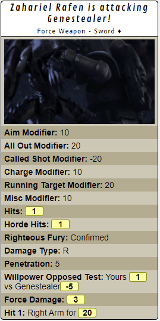

# Roll20_Deathwatch

Location for Deathwatch API and Character Sheets for Roll20.

API scripts.

1. [DW_MeleeAttack](scripts/DW_MeleeAttack.js) - A melee attack script that will target an enemy and determine hit locations.   Also can be used for force weapons to determine psychic damage.
Will be prompted for the following:

* All Out Attack
* Charging
* Aim
* Called Shot
* Running Target
* Misc - Used for any modifier not valid above.
* Power Level - The power level to use if chosen for a force weapons.

Standard Attack

ForceAttack

2. [DW_RangedAttack](scripts/DW_RangedAttack.js) - A ranged attack that will target an enemy and determine hit locations.  Also tracks ammo on the sheet and determines hit locations.

Will be prompted for the following:

* Range
* Aim
* RoF
* Called Shot
* Running Target
* Misc - Used for any modifier not valid above.

Psychic Powers

1. [Psy_Avenger](docs/psyavenger.md)
2. [Psy_Smite](docs/psysmite.md)

Effects

1. [Blood Splatter](docs/blood_splatter.md)
2. [LightningBolt](docs/lightningbolt.md)

[Character Sheet Update](docs/charactersheet.md)
