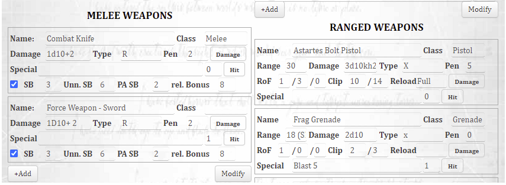

# Import the character sheet

1. row ID
2. charType
3. attack to hit button
4. helper macros

The sheet is a slight deviation from the standard Deathwatch character sheet.  It adds a row id to the repeating ranged and melee weapon sections for access to interact with the buttons on the sheet.  After the sheet is imported you need to make sure to update the row id on the sheets.  You will notice just to the left of the "Hit" button is a new unlabeled field.   That is the row ID needed by the scripts.  This value simply needs to be unique in the section.
