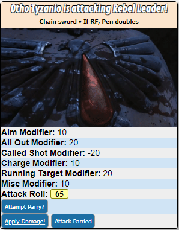
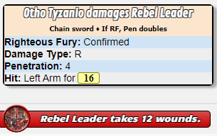
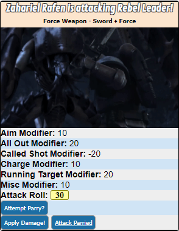
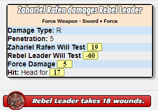
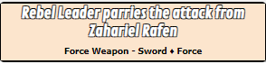

# DW_MeleeAttack

[Script](../scripts/DW_MeleeAttack.js)

This is called from the modified character sheet passing values based on the weapon selected.  This script will not immediately roll damage.   Instead it will allow you to roll a parry for the target of the attack.   Based on that then you can assign damage.

## Requirements

    - PowerCards
    - DW_ApplyWounds

## Input

This script is intended to be called from the character sheet or a macro.

* **Target** - The target of your melee attack.
* **All Out** - This indicates if the attack is using the all out ability.   Values are Yes or No.
* **Charging** - Indicates if the attacker is charging his opponent.   Values are Yes or No.
* **Aim** - The Aim value for this attack.   Values are
  * None - Represents no aiming is done.
  * Half - Represents a half action aim.
  * Full - Represents a full previous action as aim.
* **Called Shot** - Indicates if the attacker is calling their shot.  Values are Yes or No.
* **Running** - Indicates if the target is running or not.  Values are Yes or No.
* **Modifier** - Used for any miscellaneous modifier not already used above.
* **PowerLevel** - The power level to use when attack intends to imbue the weapon with psychic energy.  If the user does not have a psyRating this has no effect.

## Notes

The script does a few things of note.

* Determines where and for how much the attacks hit.
* Will re-roll the Righteous Fury attack for determining if confirmation.
* Will send hits and damage to the [DW_ApplyWounds](applywounds.md) api script.
* When using as a force weapon will roll the opposed Will checks for determining force hits and damage.
* You can enable logging of all sorts of API data by changing the value of the log constant.
* Allows you to roll a parry action with the target of the attack if allowed

    ```javascript
    const showLog = false;
    ```

## Macro

You can setup a token macro as well.   So that when the user selects their token a button for attack will appear.  This can be done on the "Attributes & Abilities" tab of the character sheet page.   You need to set-up a separate one for each melee weapon.  The key is to change the **weaponID** value to the row ID of the melee weapon you wish to setup a macro for.

```
!DW_MeleeAttack --characterName|@{character_name} --allOut|?{All Out|No,0|Yes,+20}  --charge|?{Charge|No,0|Yes,+10} --aim|?{Aim|No,+0|Half,+10|Full,+20} --calledShot|?{Called Shot|No,+0|Yes,-20} --runningTarget|?{Running|No,+0|Yes,20} --miscModifier|?{Modifier|0} --characterID|@{character_id} --weaponID|1 --targetID|@{target|token_id} --targetCharID|@{target|character_id} --powerLevel|?{PowerLevel|None,0|Fettered,1|Unfettered,2|Push,3}
```

For some scenarios it is needed to add the character token ID to the call.   This is only needed at this point for adding horde magnitude bonus to damage.   So this is only beneficial for charType of horde.  Further this only works when added as an ability macro and as a token action.

```
 --charTokenID|@{selected|token_id}
```

### Standard Attack



#### Standard Melee Attack Damage



### Force Attack



#### Force Melee Attack Damage



### Parried Attack


