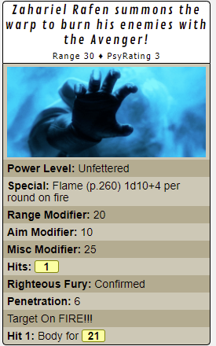

# Psy_Avenger

This is intended to be used as a extra ability attached to the character sheet under the Abilities section on the "Attributes & Abilities" tab.  You can add the following macro and then select the "Show as Token Action".   So when the player selects the token it will show up as a button.

[Psy_Avenger](../scripts/PsychicPowers/Psy_Avenger.js)

## Requirements

    - PowerCards
    - DW_ApplyWounds

## Notes

* You can enable logging of all sorts of API data by changing the value of the log constant.

    ```javascript
    const showLog = false;
    ```

## Macro

```
!Psy_Avenger --characterName|@{character_name} --powerLevel|?{Power Level|Fettered|Unfettered|Push} --range|?{Range|Point Blank,+20|Short,+10|Medium,+0|Long,-10|Extreme,-20} --aim|?{Aim|No,+0|Half,+10|Full,+20} --calledShot|?{Called Shot|No,+0|Yes,-20} --runningTarget|?{Running|No,+0|Yes,-20} --miscModifier|?{Modifier|0} --characterID|@{character_id} --targetID|@{target|Smite Target|token_id} --tokenID|@{selected|token_id}
```

## Example 

