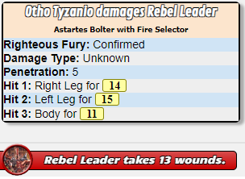
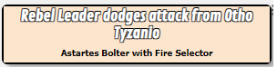

# DW_RangedAttack

[Script](../scripts/DW_RangedAttack.js)

This is called from the modified character sheet passing values based on the weapon selected.  This script will not immediately roll damage.   Instead it will allow you to roll a dodge for the target of the attack.   Based on that then you can assign damage.

## Requirements

    - ScriptCards
    - DW_ApplyWounds
    - DW_ReduceAmmo

## Input

This script is intended to be called from the character sheet.

* **Target** - The target of your ranged attack.
* **Range** - The Range modifier.   Values are
  * Point Blank - Indicates the weapon is firing at point blank range.  Less than two meters away.
  * Short - Indicates the weapon is firing at short range.   Less than half the range of the weapon.
  * Medium - Indicates the weapon is firing at medium range.   From half the range to just to double the range value.
  * Long - Indicates the weapon is firing at long range.   More than double the range of the weapon.
  * Extreme - Indicates the weapon is firing at extreme range.   More than three times the range of the weapon.
* **Aim** - The Aim value for this attack.   Values are
  * None - Represents no aiming is done.
  * Half - Represents a half action aim.
  * Full - Represents a full previous action as aim.
* **RoF** - The rate of fire of the weapon. Values are
  * Single - Single round firing from the weapon.
  * Semi - The weapon is firing at semi-automatic.
  * Full - The weapon is firing at fully automatic.
* **Called Shot** - Indicates if the attacker is calling their shot.  Values are Yes or No.
* **Running** - Indicates if the target is running or not.  Values are Yes or No.
* **Modifier** - Used for any miscellaneous modifier not already used above.

## Notes

The script does a few things of note.

* Determines if the weapon has jammed.
* Determines if the character has enough ammo to fire the round.
* Will automatically reduce the ammo for the weapon.
* Determines where and for how much the attacks hit.
* Will re-roll the Righteous Fury attack for determining if confirmation.
* Will send hits and damage to the [DW_ApplyWounds](applywounds.md) api script.
* Will send ammo count to the [DW_ReduceAmmo](reduceammo.md) api script.
* You can enable logging of all sorts of API data by changing the value of the log constant.

    ```javascript
    const showLog = false;
    ```

## Macro

You can setup a token macro as well.   So that when the user selects their token a button for the attack will appear.  This can be done on the "Attributes & Abilities" tab of the character sheet page.   You need to set-up a separate one for each ranged weapon.  The key is to change the **weaponID** value to the row ID of the ranged weapon you wish to setup a macro for.

```
!DW_RangedAttack --characterName|@{character_name} --range|?{Range|Point Blank,+20|Short,+10|Medium,+0|Long,-10|Extreme,-20} --aim|?{Aim|No,+0|Half,+10|Full,+20} --autoFire|?{RoF|Single,0|Semi,10|Full,20} --calledShot|?{Called Shot|No,+0|Yes,-20} --runningTarget|?{Running|No,+0|Yes,-20} --miscModifier|?{Modifier|0} --characterID|@{character_id} --weaponID|0 --targetID|@{target|Ranged|token_id} --targetCharID|@{target|Ranged|character_id}
```

For some scenarios it is needed to add the character token ID to the call.   This is only needed at this point for adding horde magnitude bonus to damage.   So this is only beneficial for charType of horde.  Further this only works when added as an ability macro and as a token action.

```
 --charTokenID|@{selected|token_id}
```

### Example Attack


### Ranged Damage Applied



### Ranged Damage Dodged


